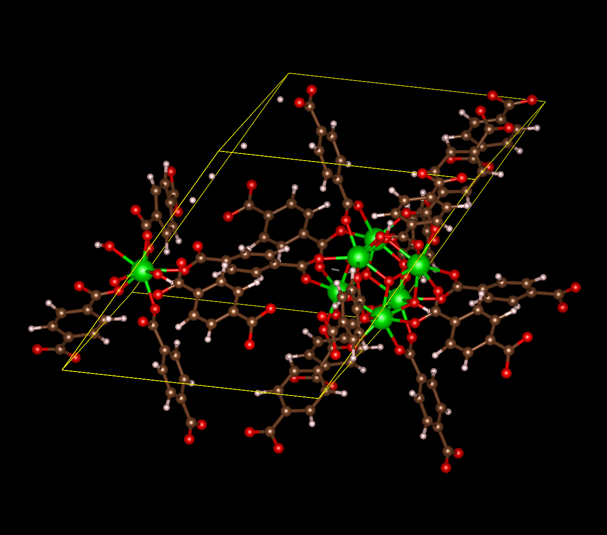
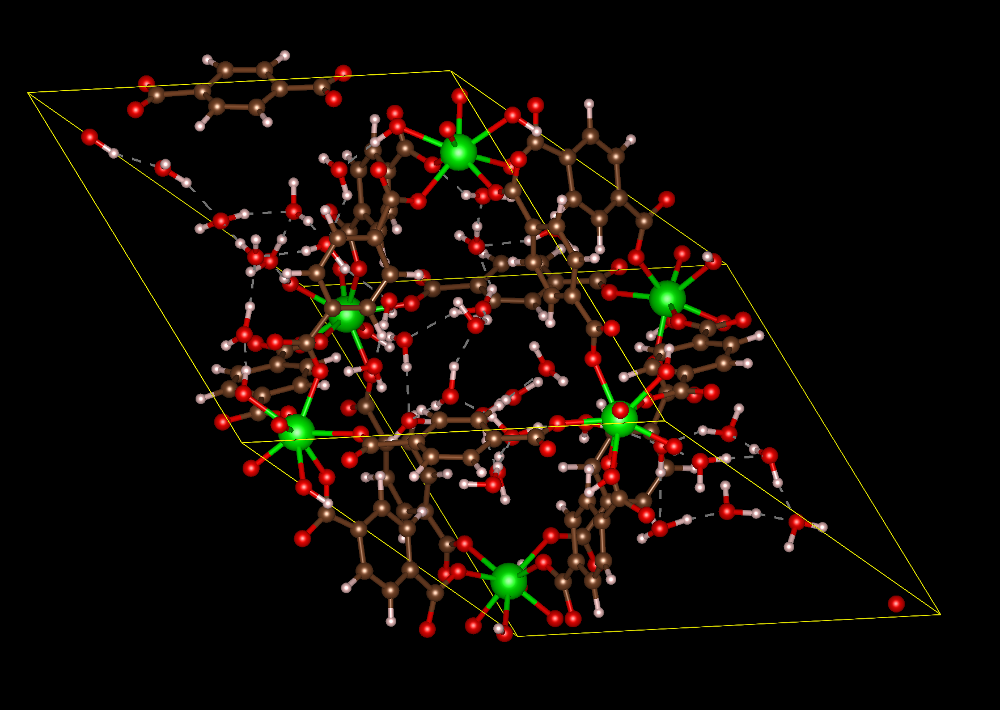
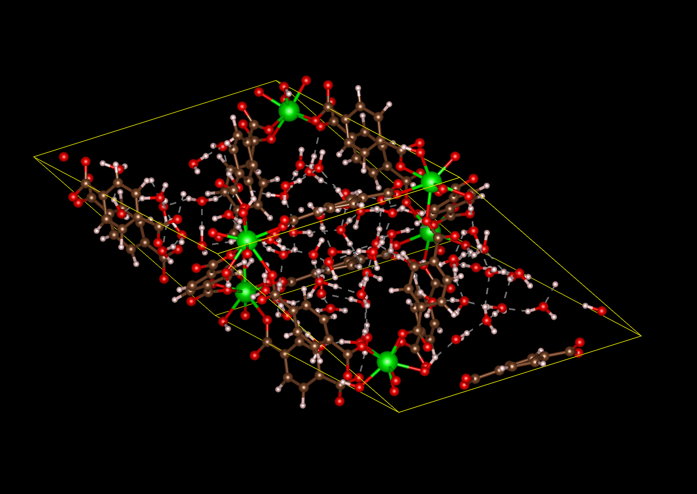

# Introduction

## Why?

- In the good old days physicists repeated each other's experiments, just to be sure. Today they stick to FORTRAN, so that they can share each other's programs, bugs included.

## What

- Besides a mathematical inclination, an exceptionally good mastery of one's native tongue is the most vital asset of a competent programmer.
- Simplicity is prerequisite for reliability.
- The easiest machine applications are the technical/scientific computations.

How do we tell truths that might hurt? E W Dijkstra, 18 June 1975
https://www.cs.utexas.edu/users/EWD/ewd04xx/EWD498.PDF

## History

{width=50%}

ENIAC, Computers, Mecanno

## von Neumann Architecture

{ width=45% }\ { width=45% }


Four main components

- Memory
- Control unit
- Arithmetic Logic Unit
- Input/Output

First draft of a report on EDVAC, 1945, http://goo.gl/DnWs3t


# Another section

## History of Fortran

- FORmula TRANslation - FORTRAN, these days Fortran
- Fortran I-IV, 1953-1961, public released 1957 with IBM 704 by John Backus

https://gcc.gnu.org/wiki/GFortranStandards
https://j3-fortran.org/doc/year/10/10-007.pdf

## Hello world!

```fortran

    program hello
      implicit none
      print *, "hello world"
    end program hello
```

#

## Q&A


{ height=40% }

##  <..>

$$\begin{split}
  x_{n+1}=&108-\cfrac{815-\cfrac{1500}{x_{n-1}}}{x_n}\\
  x_0=&4\\
  x_1 =& \frac{17}{4}
\end{split}$$


  $$ x_{42}=? $$
